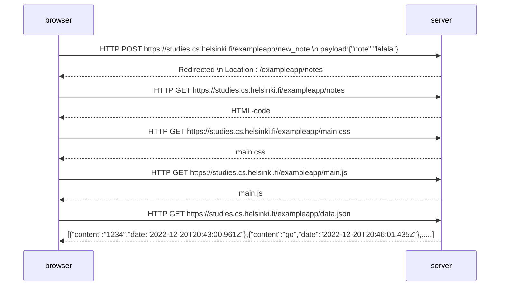

```mermaid
sequenceDiagram
browser->>server: HTTP POST https://studies.cs.helsinki.fi/exampleapp/new_note \n payload:{"note":"lalala"}
server-->>browser: Redirected \n Location : /exampleapp/notes
browser->>server: HTTP GET https://studies.cs.helsinki.fi/exampleapp/notes
server-->>browser:HTML-code 
browser->>server: HTTP GET https://studies.cs.helsinki.fi/exampleapp/main.css
server-->>browser:main.css
browser->>server:HTTP GET https://studies.cs.helsinki.fi/exampleapp/main.js
server-->>browser:main.js
browser->>server: HTTP GET https://studies.cs.helsinki.fi/exampleapp/data.json
server-->>browser:[{"content":"1234","date:"2022-12-20T20:43:00.961Z"},{"content":"go","date":"2022-12-20T20:46:01.435Z"},.....]
```